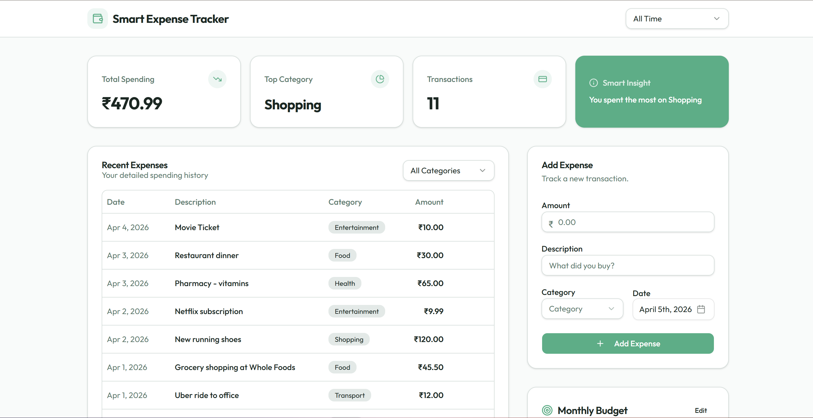
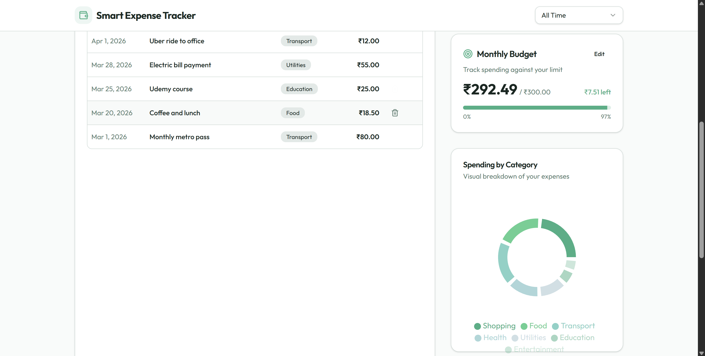

# 💰 Smart Expense Tracker Dashboard

## 📌 Overview
A full-stack expense tracking application that helps users monitor spending, manage budgets, and gain financial insights.

## 🚀 Features
- Add, delete, and track expenses
- Monthly budget tracking
- Category-wise spending analysis
- Smart insights generation
- Time-based filtering (monthly & all-time)

## 🛠️ Tech Stack
- React (Frontend)
- Node.js + Express (Backend)
- PostgreSQL (Database)
- Drizzle ORM

## 🎯 Key Learnings
- Implemented month-based filtering for accurate budget tracking
- Fixed real-world bug in expense aggregation logic
- Applied currency localization using INR

## 📸 Screenshots

### Dashboard

### Budget Alert

## 🔮 Future Improvements
- User authentication
- Export reports
- Mobile optimization
